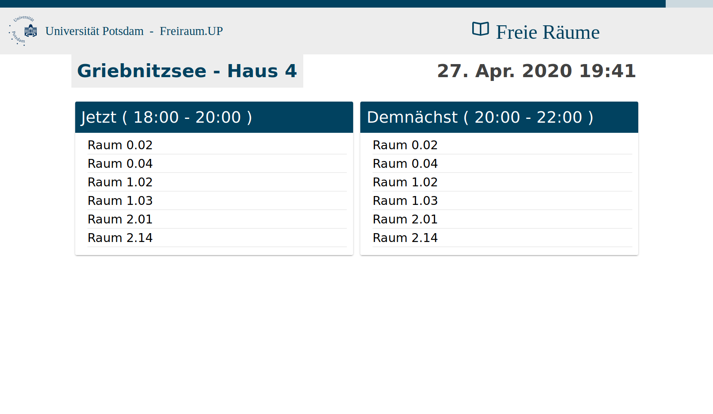

# Freiraum.UP

Dies ist die Neuimplementierung der Anwendung *Freiraum.UP*.



Die Anwendung bietet eine Übersicht im Alltag der Studierenden. Freiraum.UP beinhaltet aktuell die Funktionen:

- Mensa-Speiseplan
- Abfahrten öffentlicher Verkehrsmittel
- Anzeige der aktuell freien Räume
- Anzeige der stattfindenden Veranstaltungen
- Einbindung vordefinierter Anzeigen
- Anzeige vordefinierter Twitter-Feeds
- Anzeige von Neuigkeiten und Events

Freiraum.UP kann in zwei verschiedenen Modi (interaktiv, nicht interaktiv) betrieben werden. Außerdem
kann Freiraum.UP sowohl im Hoch- als auch im Querformat verwendet werden. Die Anwendung wurde für den Betrieb
im Format 16:9 entwickelt.

## Lokales Ausführen

```bash
$ ionic serve 
```

## Build

```bash
$ npm install -g cordova ionic
$ ionic cordova platform add browser  
$ ionic cordova prepare browser
$ ionic cordova build browser --release
```

## Konfiguration

Damit die Anwendung funktioniert muss eine Datei `config.json` im Verzeichnis `src/assets/` platziert werden. 
Diese Datei konfiguriert die gesamte Anwendung. Das Verzeichnis [configs](configs) enthält Beispiele solcher Konfigurationen
für manche Gebäude der Universität Potsdam. Diese können bereits verwendet werden, es muss lediglich ein Wert für das zu
verwendende Token in `config.api.authorization` eingetragen werden. 
Eine Dokumentation der möglichen Optionen kann [hier](src/types/Config.ts) vorgefunden werden.

- Die in der Anwendung verwendeten Texte können im Verzeichnis [/i18n](src/assets/i18n) angepasst werden
- Eine Page ist **aktiviert** wenn
  1. ein dem Namen der Page in [page.config.ts](src/app/pages.config.ts) entsprechender Abschnitt in der Datei
     `src/assets/config.json` existiert.
  2. und in diesem Abschnitt das Attribut `disabled` entweder gar nicht erst definiert ist oder den Wert `false` hat.
- Durch setzen des Attributes `force_enabled` in der zu einer Page gehörenden Sektion der `config.json` wird eine Page
  aktiviert, auch wenn diese denn den aktuell gesetzten Wert von `config.general.interactive_mode` nicht unterstützt.

## Funktionsweise

Die in der Anwendung aktiven Seiten können in der Datei `src/app/pages.config.ts` angepasst werden.
Es können neu implementierte Seiten hinzugefügt und bestehende entfernt oder angepasst werden. Eine einzelne Seite
wird als Objekt der folgenden Form konfiguriert.

```ts
  {
    component: MensaPageComponent,
    name: 'mensa',
    icon: 'pizza',
    interactiveModes: [true, false]
  }
```

- `component`: verweist auf die zu verwendende Komponente.
- `name`: legt den internen Namen der Komponente fest.
- `icon`: definiert das zu verwendende material design icon.
- `interactiveModes`: bestimmt, für welche Werte von `config.general.interactiveMode` die Seite aktiv sein soll. [true, false] würde also bedeuten, die Seite ist sowohl im interaktiven als auch nicht-interaktiven Modus benutzbar. Muss ein Array sein.

Die so definierten Komponenten werden in der Hauptkomponente `src/app/home/home.page.ts` automatisch importiert und dann eingebettet.

## Erstellung neuer Seiten

Eine neue Seite wird im Verzeichnis `src/app/pages/` angelegt. Dafür kann zum Beispiel das Skript `ionic g component $NAME` verwendet werden (sollte in jenem Verzeichnis ausgeführt werden). Um die Seite dann zu verwenden muss ein Eintrag in der bereits erwähnten Datei `src/app/pages.config.ts` für diese erstellt werden.

Um auf die Funktionen der abstrakten Seite (`src/app/components/basic-page`) zugreifen zu können sollte die neue Komponente noch die `BasicPageComponent` extenden (`NewPage extends BasicPageComponent`).

## Anzeigen

Die Seite `AdsPage` kann vordefinierte Anzeigen aus dem Verzeichnis `src/assets/ads` anzeigen. Um eine solche Anzeige
einzufügen müssen zwei Schritte erfolgen:

- Erstellen eines HTML-Dokuments für die Anzeige (z.B. `src/assets/ads/meine-anzeige.html`). Der Inhalt des Dokuments kann frei
  gestaltet werden. Es können auch CSS-Regeln und Klassen der Anwendung selbst verwendet werden.
- Erstellen eines Eintrags für die Anzeige in der Datei `/src/assets/ads/ads-config.json`. Ein solcher Eintrag
  muss wie folgt gestaltet sein:
    ```js
    {
      "ads": [
        {
          "name": "sample-ad.html", // der exakte Name des HTML-Dokuments
          "startDate": "2020-04-01", // Datum, ab wann die Anzeige gezeigt werden soll
          "endDate": "2020-04-30" // Datum, bis zu dem die Anzeige gezeigt werden soll
        }
      ]
    }
    ```
