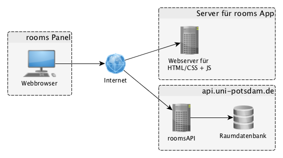

# rooms

- Build Status: [](https://travis-ci.org/University-of-Potsdam-MM/rooms)

### Table of Contents
**[Entwicklungsumgebung aufsetzen](#entwicklungsumgebung-aufsetzen)**  
**[Release für den Server vorbereiten](#release-für-den-Server-vorbereiten)**  
**[Konfiguration](#konfiguration)**  
**[Anforderungen](#anforderungen)**  
**[Architektur](#architektur)**  
**[Technologien der Webanwendung](#technologien-der-Webanwendung)**  
**[Nächste Schritte, Credits, Feedback, Lizenz](#next-steps)**  


## Entwicklungsumgebung aufsetzen

1. Installiere nodejs von http://nodejs.org/
2. Führe `npm install` im rooms Verzeichnis aus
4. Öffne die index.html in einem Webbrowser

## Release für den Server vorbereiten

Wenn alle Schritte aus der Entwicklungsumgebung ausgeführt wurde, kann der komplette Ordner als `.zip` oder `.tar.gz`
gepackt werden und auf einem beliebigen Webserver (auch ohne PHP-Unterstützung) platziert werden.

## Konfiguration

Die App beinhaltet direkt eine `config.json`.

``` js
{
    "base_url": "https://api.uni-potsdam.de/endpoints/roomsAPI/1.0/",
    "transport_base_url": "https://api.uni-potsdam.de/endpoints/transportAPI/1.0/",
    "authorization": "Bearer xxxxxxx", // Das Token, von api.uni-potsdam.de
    "xml_proxy_path": "./xml.php",
    "use_xml_proxy": false, // soll der xml_proxy_path als fallback benutzt werden? Z.B. wenn die CORS-Header nicht richtig gesetzt sind.
    "campus": 3, // Auf welchem Campus hängt das Panel?
    "house": 6, // In welchem Haus hängt das Panel?
    "station_id": "009230003#86", // ID der Station für die Nahverkehrsinformationen
    "events_rss_feed_url": "https://www.uni-potsdam.de/veranstaltungen/rss-feed-abonnieren/eventfeed/feed/xml.html?tx_upevents_upeventfeed%5Blimit%5D=30&tx_upevents_upeventfeed%5Bcat%5D=&tx_upevents_upeventfeed%5BcatLink%5D=or", // URL zum Rss-Feed der Veranstaltungen der Uni-Potsdam
    "news_rss_feed_url": "http://www.uni-potsdam.de/nachrichten/rss-feed-abonnieren.html?type=100&tx_ttnews%5Bcat%5D=19", // URL zum Rss-Feed der Nachrichten der Uni-Potsdam 
    "news_per_page": 3, // Anzahl der News pro Seite
    "local_traffic_count": 2, // Anzahl der nächsten ÖPNV-Einträge auf allen Seiten
	"news_update_frequency": 60, // Nach wievielen Sekunden wird das News RSS-Feed neu abgeholt
	"events_update_frequency": 60, // Nach wievielen Sekunden wird das Events RSS-Feed neu abgeholt
	"transport_update_frequency": 60, // Nach wievielen Sekunden wird die Transport API neu abgefragt
	"rooms_update_frequency": 60, // Nach wievielen Sekunden wird die Veranstaltungs API neu abgefragt
	"switch_page_frequency": 10, // Nach wievielen Sekunden wird zur nächsten Seite geblättert
	"twitter_widget_id": "627066449773875201" // die Twitter Widget ID von https://twitter.com/settings/widgets
}
```

Die Parameter campus und house können für einen Seitenaufruf überschrieben werden, in dem man sie hinten an die URL
ranhängt. Zum Beispiel: `/index.html?campus=3&house=1` würde das Panel für Campus 3 und Haus 1 laden.

Zu Testzwecken ist es möglich mit dem URL-Parameter `now` die Uhrzeit und den Tag zu überschrieben. Zum Beispiel würde
`/index.html?campus=3&house=6&now=2014-07-28T10%3A00%3A00.000Z` das Panel für den 28.7.2014 um 10 Uhr laden. Hierbei ist
wichtig zu beachten, dass die Daten nur aus der Zukunft von der `roomsAPI` zurückgegeben werden.

Zu Testzwecken ist es auch möglich mit dem URL-Parameter `page` auf eine bestimmte Seite des Panels zu switchen ohne,
dass das Panel nach der `switch_page_frequency` weiterblättert. Zum Beispiel würde `/index.html?page=0` immer nur die
erste Seite anzeigen.

# Anforderungen

- 46 zoll
- 15-26 Seminarräume, 7 HS

## Ansichten

- Welche Räume sind gerade frei?
- Welche Veranstaltungen laufen gerade?
- Welche Veranstaltungen kommen bald?
- Hinweis, wenn das Netz nicht verfügbar ist!

## Tasks

- Konfigurationsdatei für URL's / Endpoints
- Dokumentation der Einbindung weiterer Darstellungsseiten
- Darstellung
- ? Soap-Client
- ? Framework für views

## Use-Cases

Hier einige User die ich mir bei dem Konzeptionieren des Panels überlegt habe.

- Alice (39%)
  - 1. Semester
  - Weiß dass sie heute ab 10:00, "Staatsrecht I" bei Herrn "M.M." hat
  - Weiß nicht ob sich der Raum geändert hat
- Bob (60%)
  -  5. Semester
  - Sucht einen Raum für seine Übungsgruppe

- Carl (1%)
  - Kein Semester, ist Gastredner
  - Möchte am "Kolloquium für Master im Bereich Internationale Politik" (von K.K., R.R. und H.H.) von 12:00 bis 14:00 teilnehmen

# Architektur

- Webanwendung
  - `index.html`
  - `js/ShowRooms.js`
- Zugriff von der Webanwendung per `Bearer`-Token auf die roomsAPI
- [roomsAPI](https://api.uni-potsdam.de/store/apis/info?name=roomsAPI&version=1.0&provider=admin) auf dem [USB](https://api.uni-potsdam.de/)
  - `/rooms4Time`
  - `/reservations`




# Technologien der Webanwendung

Die folgenden Technologien werden bei der Umsetzung der `rooms` Webanwendung benutzt:

| Technologie        | Verwendungszweck           | Link  |
| ------------- |-------------|:-----:|
| nodejs      | zur primären Installation von Bower | http://nodejs.org |
| bower      | Installation der Webbibliotheken | http://bower.io |
| bootstrap | HTML/CSS-Framework für das Layout | http://getbootstrap.com |
| require.js | Dependency Library für Javascript | http://requirejs.org |
| jsb.js | Library um Javascript-Verhalten ohne Inline-JS auf HTML-Elemente zu tun | - |
| html5shiv | Polyfill damit HTML5-Elemente auch in älteren Browsern funktionieren | - |
| respond.js | Media-Query Polyfill für ältere IE-Browser | - |
| Composer und Doctrine-Cache | Für xml.php (als Fallback falls die externe Api nicht verfügbar ist oder CORS-Header nicht richtig gesetzt sind) | - |


## Entitäten (JS Objekte)

### `ShowRooms` Komponente

Ist für die Aktualisierung des Panels zuständig. 

Es beinhaltet zwei Anzeigen: `.js_now` und `.js_soon`. `.js_now` bezieht sich auf den aktuellen 2 Stundenblock (beginnt immer auf ganze 2 Stunden) und `.js_soon` bezieht sich auf den 2 Stundenblock danach.

In jedem Block werden die damit verknüpften `Reservation`s und `FreeRoom`s angezeigt.

`FreeRoom`s werden dabei in `this.free_rooms` von `ShowRooms` gehalten. Sie beziehen sich immer auf den aktuellen Stundenblock.

Die `Reservation`s werden in `this.reservations` von `ShowRooms` komplett gehalten, für den Zeitraum vom Beginn des ersten Stundenblocks und bis zum Ende des zweiten Stundenblocks geladen. Erst beim rendern wird mit `Reservation#isRunningAtTime` getestet, ob der Stundenblock auch dort angezeigt wird. Das hat den Vorteil, dass es auch funktioniert, wenn eine Reservierung über 2 Stundenblöcke hinweg stattfindet.

Da die `free4Time` API Methode ab und an trotzdem Räume liefert, die nicht frei sind, wird in `ShowRooms#refreshReservations()` eine Variable `used_rooms` mit allen geblockten Räumen gefüllt und beim Abholen der freien Räume diese Liste noch mal danach gefiltert.

### `Reservation(name, start_time, end_time, campus, house, room, person_name)`

Bildet eine einzelne Reservierung für einen Raum ab.

Zum Beispiel wird eine Reservierung so initialisiert:

``` js
new Reservation(
	'V/G1 - Öffentliches Wirtschaftsrecht I',
	'2014-02-04T18:00:00+01:00',
	'2014-02-04T16:00:00+01:00',
	3,
	1,
	'H10'
);
```

### `FreeRoom(campus, house, room)`

Bildet einen einzelnen freien Raum ab.

Zum Beispiel wird Raum 04.06.S01 so initialisiert:

``` js
new FreeRoom(4, 6, "S01");
```

## Schnittstellen

### API Aufruf nach `/reservations`

``` xml
<S:Envelope xmlns:S="http://schemas.xmlsoap.org/soap/envelope/">
    <S:Body>
      <ns2:reservationsResponse xmlns:ns2="http://rooms.provider.elis.unipotsdam.de/">
        <return>
          <endTime>2014-02-04T18:00:00+01:00</endTime>
          <startTime>2014-02-04T16:00:00+01:00</startTime>
          <roomList>
            <room>3.01.H10</room>
          </roomList>
          <personList>
            <person>Jochen Bley</person>
          </personList>
          <veranstaltung>V/G1 - Öffentliches Wirtschaftsrecht I</veranstaltung>
        </return>
        <!-- weitere <return> -->
      </ns2:reservationsResponse>
    </S:Body>
</S:Envelope>
```
### API Aufruf nach `/rooms4Time`

Parameter:

- endTime: aktuelle Zeit als ISO-Zeit String
- startTime: aktuelle Zeit als ISO-Zeit String
- campus: Nummer des Campus
- cb: Cachebuster Parameter (zufällige Zahl)

Beispielantwort:

``` xml
<S:Envelope xmlns:S="http://schemas.xmlsoap.org/soap/envelope/">
  <S:Body>
    <ns2:rooms4TimeResponse xmlns:ns2="http://rooms.provider.elis.unipotsdam.de/">
      <return>3.01.1.14</return>
      <return>3.01.1.50</return>
    </ns2:rooms4TimeResponse>
  </S:Body>
</S:Envelope>
```

## Neue Seite anlegen

Wenn eine weitere Seite auf dem Panel angezeigt werden soll, ist das relativ einfach.

Es gibt bereits 2 Seiten (soon + now unter dem css-Selektor `.container > .js_page`), will man davor eine Seite hinzufügen, sieht das so aus:

``` html
    <div class="container">

        <!-- neue Seite -->
        <div class="row js_page">
            <h2 class="hidden">Interner Bezeichner für die Seite</h2>
            <table class="table table-striped table-hover">
                <thead>
                <th>Die Überschrift</th>
                </thead>
                <tbody>
                    <tr>
                        <td>Die erste Zeile <strong>mit dickem Text</strong> und <em>hervorgehobene Text</em>.</td>
                    </tr>
                </tbody>
            </table>
        </div>

        <div class="row js_page">
            <h2 class="hidden">Laufende Veranstaltungen</h2>
            <table class="js_now table table-striped table-hover">
                <thead>
                    <th class="js_now_headline">Gerade</th>
                </thead>
                <tbody>
                </tbody>
            </table>
        </div>
        <div class="row js_page">
            <h2 class="hidden">Laufende Veranstaltungen</h2>
            <table class="js_soon table table-striped table-hover">
                <thead>
                <th class="js_soon_headline">In 2 Stunden</th>
                </thead>
                <tbody>
                </tbody>
            </table>
        </div>

    </div>
```

Das Ergebnis sieht dann ungefähr so aus:


#Nächste Schritte, Credits, Feedback, Lizenz
